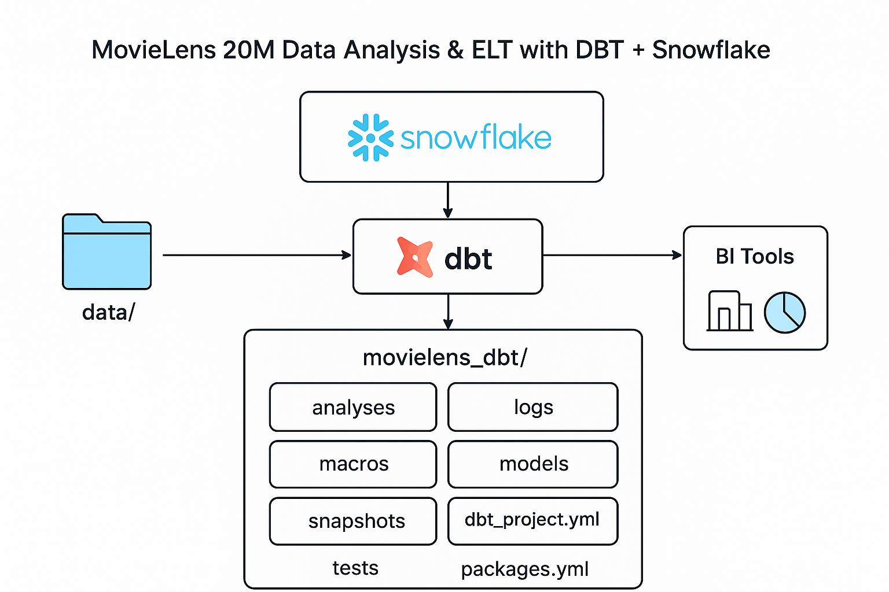

# 🎬 MovieLens 20M Data Analysis & ELT with DBT + Snowflake

This project demonstrates how to build a modern **data pipeline** for analyzing the **MovieLens 20M dataset** using **Snowflake** as the cloud data warehouse and **DBT (Data Build Tool)** for ELT (Extract, Load, Transform) workflows.

The goal is to showcase best practices in **data modeling, transformation, and analytics engineering** while enabling scalable insights into movie ratings, user behavior, and recommendation patterns.

## 🚀 Project Overview

<table>
  <tr>
    <td>
      
    </td>
    <td>
      <ul>
        <li><strong>Dataset</strong>: <a href="https://grouplens.org/datasets/movielens/20m/">MovieLens 20M</a> (20 million ratings, 465k tags, 27k movies, 138k users)</li>
        <li><strong>Data Warehouse</strong>: <a href="https://www.snowflake.com/">Snowflake</a></li>
        <li><strong>Transformation Layer</strong>: <a href="https://www.getdbt.com/">DBT</a></li>
        <li><strong>Orchestration</strong>: DBT CLI / Cloud</li>
        <li><strong>Visualization (Optional)</strong>: BI tools like Tableau, Power BI</li>
      </ul>
    </td>
  </tr>
</table>

## 📂 Repository Structure

```bash
├── data/                       # Raw dataset files (MovieLens 20M)
├── movielens_dbt/              # DBT project folder
│   ├── analyses/               # Ad-hoc SQL analyses and exploration
│   ├── logs/                   # DBT run logs and debug information
│   ├── macros/                 # Custom Jinja macros for reusable SQL logic
│   ├── models/                 # DBT models (staging, marts, analytics)
│   ├── seeds/                  # Static reference data
│   ├── snapshots/              # Slowly changing dimensions (if needed)
│   ├── tests/                  # Data quality tests
│   ├── dbt_project.yml         # Main DBT project configuration file
│   ├── package-lock.yml        # Dependency lock file for reproducible builds
│   └── packages.yml            # DBT package dependencies
├── sf_user_creation.sql        # SQL script to create Snowflake user, roles, and grants
├── docs/                       # Documentation & diagrams
└── README.md                   # Project documentation
```

## 🛠️ Setup Instructions

#### **Step 1:** Clone the Repository

```bash
git clone https://github.com/gangulyaritra/dbt-projects.git
cd dbt-movielens-data-analysis\movielens_dbt
```

#### **Step 2:** Load Data into Snowflake

Run the `sf_user_creation.sql` script in the Snowflake Worksheet to configure the necessary user and environment, and then proceed to load the MovieLens 20M dataset into Snowflake.

#### **Step 3:** Configure DBT

- Install DBT (CLI or Cloud): `pip install dbt-snowflake`
- Update `profiles.yml` with Snowflake credentials.
- Use `dbt docs generate` && `dbt docs serve` to view lineage and documentation.

## 📖 DBT Commands Reference

List of the below tables provides a categorized overview of commonly used **dbt CLI commands**.

---

### 🔧 Project Setup & Configuration

| Command     | Description                                     |
| ----------- | ----------------------------------------------- |
| `dbt init`  | Initialize a new dbt project.                   |
| `dbt debug` | Test connection and validate configuration.     |
| `dbt deps`  | Install dependencies from `packages.yml`.       |
| `dbt clean` | Remove `dbt_packages` and `target` directories. |

---

### ▶️ Build & Run Models

| Command        | Description                                                    |
| -------------- | -------------------------------------------------------------- |
| `dbt run`      | Execute models (build tables/views).                           |
| `dbt build`    | Run models, tests, snapshots, and seeds in one command.        |
| `dbt compile`  | Compile models into raw SQL without executing.                 |
| `dbt seed`     | Load CSV files from the `seeds/` directory into the warehouse. |
| `dbt snapshot` | Apply snapshot logic for slowly changing dimensions.           |

---

### ✅ Testing & Documentation

| Command             | Description                                   |
| ------------------- | --------------------------------------------- |
| `dbt test`          | Run tests defined in your project.            |
| `dbt docs generate` | Generate documentation site for your project. |
| `dbt docs serve`    | Serve the documentation locally in a browser. |

---

### 📊 Analysis & Exploration

| Command             | Description                                                  |
| ------------------- | ------------------------------------------------------------ |
| `dbt run-operation` | Execute a macro directly from the command line.              |
| `dbt list`          | List resources (models, tests, seeds, etc.) in your project. |
| `dbt source`        | Manage and test source freshness.                            |

---

### 🔄 Deployment & Execution

| Command                         | Description                              |
| ------------------------------- | ---------------------------------------- |
| `dbt run --model <model_name>`  | Run specific models.                     |
| `dbt run --full-refresh`        | Rebuild incremental models from scratch. |
| `dbt build --select <resource>` | Build only selected resources.           |

---

### 🧰 Utility & Maintenance

| Command                        | Description                                  |
| ------------------------------ | -------------------------------------------- |
| `dbt compile --select <model>` | Compile only specific models.                |
| `dbt debug --config-dir`       | Show where dbt is looking for configuration. |
| `dbt clean`                    | Remove compiled artifacts and dependencies.  |

## Resources

- Learn more about dbt [in the docs](https://docs.getdbt.com/docs/introduction).
- Check out [Discourse](https://discourse.getdbt.com/) for commonly asked questions and answers.
- Join the [chat](https://community.getdbt.com/) on Slack for live discussions and support.
- Find [dbt events](https://events.getdbt.com) near you.
- Check out [the blog](https://blog.getdbt.com/) for the latest news on dbt's development and best practices.
- YouTube Reference: [DBT Projects Tutorial Video](https://www.youtube.com/watch?v=zZVQluYDwYY)
